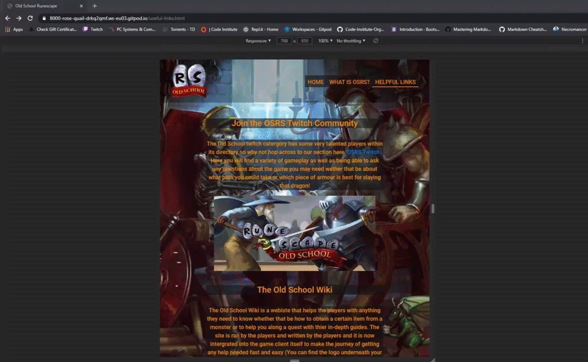

# Old School Runescape - Testing
[Main README.md File](/README.md)

1. [Testing User Stories](#Testing-User-Stories)
2. [Manual Testing](#Manual-Testing)
3. [Automated Testing](#Automated-Testing)
   * [Code Validation](#Code-Validation)
   * [Broswer Validation](#broswer-validation)
   * []
4. 

## Testing User Stories

### **New Players Goals**:
1. As a new player, I want to easily navigate my way around the website and find the relavant content.
  * The navigation bar is clearly identifiable and easily navigable for users to find and use.
  * The logo image on the yop left of the every page allows users to click it and return to the homepage.
  * The footer menu with clear icons used to allow users to quickly know which webiste they will be taken too once they are clicked.

2. As a new player, I want to learn about the games history.
  * The **'osrs'** page is an abbreviation of the games name and when clicked the user will be taken to a site about the history behind the game.
  * The **'osrs'** page is easy to naviagte to, no matter what device is used.
  * Video's are used to encourage the user to watch and learn about the game the history of the game they're looking to play.

3. As a new player, I want to be able to easily go to any of the games social media pages to keep up with any news or updates.
  * The social links will always appear in the footer on all devices to keep the nav bar clean and easy to read.
  * When users click on the link for their preferred social network which will be represented by the appropriate logo and will also open in a new tab.

4. As a new player, I want to be able to find any helpful information to help play the game.
  * The **Useful Links** page is appropriately named for the users to navigate to, which will allow them users to visit external sites to help them in game.
  * The **Useful Links** page will allow the users to navigate to [Twitch](Twitch.tv "Twitch homepage") to help them visually look at the streamers playing the game.
  * The **Useful Links** page will show clients that the users are able to use depending on the device they're using;
    * Whilst browsing on desktops and laptops the page will display clients players use whilst on them, each will have a label of the appropriate client and when clicked on will take 
    the user to the homepage of each link clicked.
    * Whilst browsing on tablet and mobile devices the links used will take the users to the appropriate App store to either Apple or Android each displayed by thier appropriate Icons.

### **Current Players**:
1.  As a current player, I want to be able to find the social links to keep up with any news.
* The user will be able to click any of the social media icons located in the footer to take them to the appropriate platform to find any important news they seek.

2. As a current player, I want to find out about any new upcoming releases.
* The homepage will be updated each time a big update has happened to allow users to quickly find out what is happening in game.
* The user will also be able to check out the social links in the footer to find any news that is happening regarding the game.

3. As a current player, I want to find any information to help me return to the game.
* The **Useful Links** page will allow the user to go to the dedicated wiki page of the game to allow them to quickly use the game wiki for information they need to use in game.
* The footer will also take the user to the social platform of their choice to be able to see older updates that have been introduced in game.

**Returning Players**:
1. As a returning player, I want to navigate to information about updates I have missed.
* The homepage will display a video of the latest update in game and will be headed by an alert box to enusre the user doesn't miss them.
* The user can also click any of the social links in the footer to look over older updates/news they have missed.

2. As a returning player, I want to be able to go to any social links to find relavant information.
* The footer will display all the social accounts of **Old School Runescape** to allow easy access to the user.
* Each link is easily identifiable by the use of the appropriate icons.

## Manual Testing

### Common Elements Testing.
The developer manually tested the following effects to ensure they are displayed and functioning properly.

* Hovering on the navigation bar will trigger the **'hover'** effect and also to confirm the link the users are on.

* Hovering over Social Media links will trigger the **'hover'** effect and once clicked will open a new tab.

  * YouTube:
  
  * Twitch:
  
  * Facebook:
  
  * Twitter:
  
  * Reddit:
  
  * Steam:
  

## Homepage

### Manual testing was performed on the following elements of the [Homepage](index.html)

* Clicking on the logo in the left hand corner of the screen will refresh the page.

* When on the Homepage the navbar will show it is active with a line underneath the link.

* When first arriving on the **Homepage** the video used will autoplay.

* The responsiveness of the Homepage:

## Osrs Page

### Manual testing was performed on the following elements of the [Osrs Page](osrs.html)

* Clicking on the logo in the top left corner will return the user to the Homepage.

* Whilst on the Osrs page the nav bar will display it as active with a bar underneath the link.

* When arriving at the Osrs page the video will instantly play for the user.

* Responsiveness of the Osrs Page

## Useful Links Page

### Manual testing was conducted by the developer on the following elements of the [Useful Links Page](useful-links.html)

* Clicking on the logo in the top left will return the user back to the homepage when clicked.

* Whilst browsing the Useful Links page it will show as active with a bar underneath the link.

* When the user clicks on the link provided in the paragraph it will take them to the OSRS directory 
on [Twitch](Twitch.tv) in a new tab.

* The image underneath the paragraph will also take the user to [Twitch](Twitch.tv) in a new tab.

* The image used underneath the section about the games Wiki will take players to the homepage of that 
webiste and will open in a new tab.

* The **Vanilla Client** will start a download once clicked, whilst the other two will direct the users to 
the appropriate webiste when clicked.

  * Vanilla Client will prompt a download when clicked.
  

  * The logo of RuneLite when clicked will take users to the homepage of the website in a new tab.
  

  * The image used for the [Steam](https://store.steampowered.com/) will take the user to the Old School Runescape Steam store page in a new tab.
  

* Whilst users view the page on tablet or mobile then the desktop links will not be visable and only the appropriate app store's will display.

### Responsiveness of the [Useful Links Page](useful-links.html)

